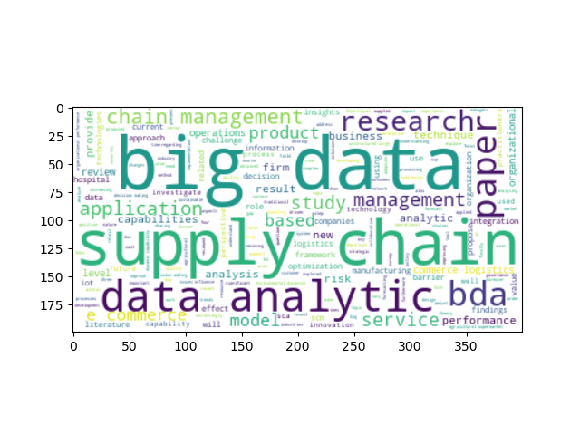
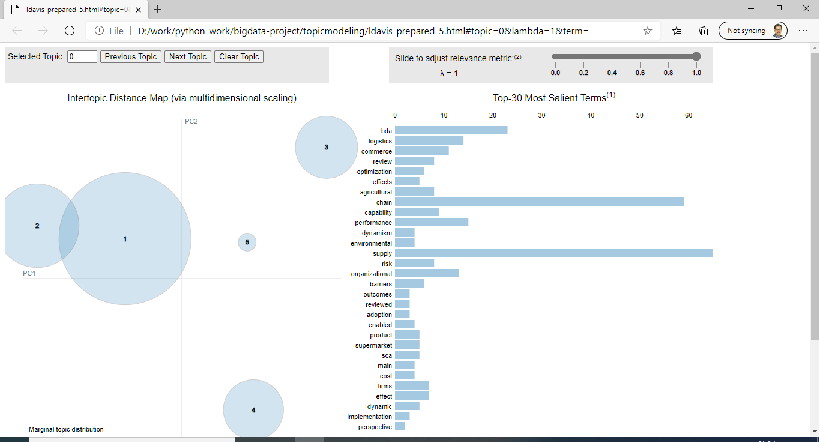

---
author:
- Dr. Kamakshaiah Musunuru
title: "`topmodpy`: A Simple Python Script for Topic Modeling"
---

# ABSTRACT

Subjective assessment is rampant in literature verification and title
evaluation. While subjective assessment is a valid practice but creates
a void in terms of validity of results. Intuition is unique and tend to
depend on several other aspects which are not methodological. As a
result of which, there may be a possibility of unreasonable yet unfair
amount of personal opinion in action. Natural Language Processing (NLP)
offers robust mechanisms or techniques to evaluate unstructured data.
Latent Dirichlet Allocation (LDA) is one of such techniques which adds
logic while processing unstructured but subjective data. This article
explains suitability of `topmodpy` to perform Latent Semantic Analysis
(LSA) using Latent Dirichlet Allocation (LDA). `topmopy` is a Python
script and is a collection of 12 different functions each with a unique
aim. This article shows as how to use `topmopy` module on certain data
collected using a valid search criteria. `topmodpy` module found to have
obtained these latent constructs related to search criteria. Hence the
efficacy of the module has been proved.

***Keywords***: Python, Latent Dirichlet Allocation (LDA), latent
semantic analysis, text mining, topic modeling.

# CITATION

Musunuru, K. (2020). `topmodpy`: A Simple Python Script for Topic
Modeling. Retrieved from
[find/the/url/at/the/bottom/of/this/page](find/the/url/at/the/bottom/of/this/page){.uri}.

# BACKGROUND

> "Traditional philosophy relies heavily on the use of rational
> intuition to establish theses and conclusions \... *appeal to rational
> intuition is epistemically justified only if a form of foundationalism
> is true.*"\
>
> ::: flushright
> \- Steven D. Hales, \"The Problem of Intuition\"
> :::
>
> [@1]

Intuition and logic is probably the two most vital skills required to
make decisions effectively. People often take bipartite opinion while
arguing about intuition vs logic. They are two very different yet
effective and above all complements each other. Logic is the one's
cognitive ability used to solve problems based on rules and principles.
Logical approach always remains systematic backed by scientific methods.
Logical thinking can be associated with problem solving and often stands
on proofs or evidences. Intuitive thinking, on the other hand, can be
described as a sense of reason developed through experience and
perceptions. This is why, intuition always confused with superstition.
Perhaps, intuition in absence of logic can be a hunch. There is a middle
path known as *logical intuition* or *mathematical intuition* which is a
series of instinctive foresight, know-how often associated with the
ability to perceive logical or mathematical truth and the ability to
solve mathematical challenges efficiently using one's intuitive
capabilities.

## Critical Thinking

*What is critical thinking? Is this anything to do with intuitive
thinking? No.* Critical thinking is a skill that involves clear,
purposeful, and goal-oriented thinking. Critical thinking arises while
interpreting or explaining the scenario in hand. Some extent, it is the
ability to think cautiously and rationally to resolve problems.[@2]
Hence, the reason and rationality assumes highest priority in critical
thinking. Critical thinking can be practiced by using conclusions
without *biases, reliable evidence and reasoning* and it is only
possible through data and information. Critical thinking is an
imperative analytical skill as it underpins contemporary living in areas
such as education and professional careers, but it is not restricted to
a specific area.

> "Critical thinking is the intellectually disciplined process of
> actively and skillfully conceptualizing, applying, analyzing,
> synthesizing, and/or evaluating information gathered from, or
> generated by, observation, experience, reflection, reasoning, or
> communication, as a guide to belief and action."
>
> ::: flushright
> \- Michael Scriven & Richard Paul
> :::

[@3]

*Critical thinking is used to solve problems, calculate the likelihood,
make decisions, and formulate inferences*. Critical thinking requires
examining information, reflective thinking, using appropriate skills,
and confidence in the quality of the information given to come to a
conclusion or plan. Critical thinking includes being willing to change
if better information becomes available. As a critical thinker
individuals do not accept assumptions without further questioning the
reliability of it with further research and analysing the results found.

> "Critical thinking is deciding rationally what to or what not to
> believe."
>
> ::: flushright
> \- Norris, Stephen P.
> :::

[@4]

## Text mining

*Is it text mining a kind of namesake tool? Can text mining offer a
solution for intuitive logic?* Text mining deals with text analytics and
is the process of obtaining information from text. It involves
extracting information from different written resources which is not
possible through subjective assessment. Written resources may include
websites, books, emails, reviews, and articles. High-quality information
is typically obtained by devising patterns and trends by means such as
statistical pattern learning. Text mining can be done through three
different perspectives: *information extraction, data mining, and
Knowledge Discovery in Databases (KDD).* [@5] Text mining usually
involves the process of structuring the input text. The text is usually
parsing, along with the addition of some derived linguistic features and
the removal of others, and subsequent insertion into a database,
deriving patterns within the structured data, and finally evaluation and
interpretation of the output. Typical text mining tasks include text
categorization, text clustering, concept/entity extraction, production
of granular taxonomies, sentiment analysis, document summarization, and
entity relation modeling. [@6] [^1]

Text analysis involves information retrieval, lexical analysis. It is
also possible to use few statitical techniques like association
analysis, predictive analytics and visualizations. A typical set of
activities are scanning a set of documents, written in a natural
language, modeling those documents for decision making. The document is
the basic unit of element in text mining. The term text analytics
describes a set of linguistic, statistical, and machine learning
techniques that model and structure the information content of textual
sources for business intelligence, exploratory data analysis, research,
or investigation. Most of the data is unstructured and it is primarily
in the form of text.

## The data deluge

*Why do we need a new approach for text analysis?* According to market
intelligence company IDC, the 'Global Datasphere' in 2018 reached 18
zettabytes. This is the total of all data created, captured or
replicated. In fact, IDC predicts the world's data will grow to 175
zettabytes ($1000^7$ KBs) in 2025. [@7] [@8] Whooping amount of data is
being generated daily at lightening speed. As much as 90 percent of that
data is defined as unstructured data. But what does that mean and what
do you need to know about unstructured data? We delve into the details
below. Unstructured data arises from few sources such as text files,
photos, video files, audio files, webpages, blog posts, social media
sites, presentations, call center transcripts/recordings, open-ended
survey responses and others.

The growing data poses so many problems while creating sense.

::: tiny
  Source           Online (incl. social)   TV    Social media   Radio   Print (incl.mags)
  ---------------- ----------------------- ----- -------------- ------- -------------------
  UK               79%                     71%   47%            35%     18%
  USA              73%                     60%   47%            21%     16%
  Germany          69%                     72%   39%            41%     26%
  Spain            83%                     71%   63%            24%     28%
  South Korea      85%                     65%   51%            14%     19%
  Argentina        90%                     77%   78%            24%     30%
  Average change   2                       5     5              2       -2
  from January                                                          

  : Online news growth in 2020.
:::

Notes: More information is available at
<https://www.digitalnewsreport.org/survey/2020/overview-key-findings-2020/>

# LATENT SEMANTIC ANALYSIS

Latent semantic analysis (LSA) is a technique in natural language
processing, in particular distributional semantics, of analyzing
relationships between a set of documents and the terms they contain by
producing a set of concepts related to the documents and terms. LSA
assumes that words that are close in meaning will occur in similar
pieces of text (the distributional hypothesis). A matrix containing word
counts per document (rows represent unique words and columns represent
each document) is constructed from a large piece of text and a
mathematical technique called singular value decomposition (SVD) is used
to reduce the number of rows while preserving the similarity structure
among columns. Documents are then compared by taking the cosine of the
angle between the two vectors (or the dot product between the
normalizations of the two vectors) formed by any two columns. Values
close to 1 represent very similar documents while values close to 0
represent very dissimilar documents.

An information retrieval technique using latent semantic structure was
patented in 1988 (US Patent 4,839,853, now expired) by Scott Deerwester,
Susan Dumais, George Furnas, Richard Harshman, Thomas Landauer, Karen
Lochbaum and Lynn Streeter. In the context of its application to
information retrieval, it is sometimes called latent semantic indexing
(LSI)

## Latent Dirichlet Allocation

The latent Dirichlet allocation (LDA) is a generative statistical model
that allows sets of observations to be explained by unobserved groups
that explain why some parts of the data are similar. For example, if
observations are words collected into documents, it posits that each
document is a mixture of a small number of topics and that each word's
presence is attributable to one of the document's topics. LDA is an
example of a topic model and belongs to the machine learning toolbox and
in wider sense to the artificial intelligence toolbox. In the context of
population genetics, LDA was proposed by J. K. Pritchard, M. Stephens
and P. Donnelly in 2000. LDA was applied in machine learning by David
Blei, Andrew Ng and Michael I. Jordan in 2003.

## Model

With plate notation, which is often used to represent probabilistic
graphical models (PGMs), the dependencies among the many variables can
be captured concisely. The boxes are \"plates\" representing replicates,
which are repeated entities. The outer plate represents documents, while
the inner plate represents the repeated word positions in a given
document; each position is associated with a choice of topic and word.
The variable names are defined as follows:

{width="\\columnwidth"}

{width="\\columnwidth"}

The fact that W is grayed out means that words $w_{ij}$ are the only
observable variables, and the other variables are latent variables. As
proposed in the original paper, a sparse Dirichlet prior can be used to
model the topic-word distribution, following the intuition that the
probability distribution over words in a topic is skewed, so that only a
small set of words have high probability. The resulting model is the
most widely applied variant of LDA today. The plate notation for this
model is shown on the right, where $K$ denotes the number of topics and
$\varphi_{1},\dots ,\varphi_{K}$ are $V$-dimensional vectors storing the
parameters of the Dirichlet-distributed topic-word distributions ($V$)
is the number of words in the vocabulary).

It is helpful to think of the entities represented by $\theta$ and
$\varphi$ as matrices created by decomposing the original document-word
matrix that represents the corpus of documents being modeled. In this
view, $\theta$ consists of rows defined by documents and columns defined
by topics, while $\varphi$ consists of rows defined by topics and
columns defined by words. Thus, $\varphi_{1},\dots ,\varphi_{K}$ refers
to a set of rows, or vectors, each of which is a distribution over
words, and $\theta_{1},\dots ,\theta_{M}$ refers to a set of rows, each
of which is a distribution over topics.

## Generative process

To actually infer the topics in a corpus, we imagine a generative
process whereby the documents are created, so that we may infer, or
reverse engineer, it. We imagine the generative process as follows.
Documents are represented as random mixtures over latent topics, where
each topic is characterized by a distribution over all the words. LDA
assumes the following generative process for a corpus $D$ consisting of
$M$ documents each of length $N_{i}$:

1.  Choose $\theta_{i}\sim \operatorname{Dir} (\alpha)$, where
    $i\in \{1,\dots ,M\}$ and $\mathrm {Dir} (\alpha )$ is a Dirichlet
    distribution with a symmetric parameter $\alpha$ which typically is
    sparse $(\alpha < 1)$

2.  Choose $\varphi_{k}\sim \operatorname {Dir} (\beta )$, where
    $k\in \{1,\dots ,K\}$ and $\beta$ typically is sparse

3.  For each of the word positions $i,j$, where $i\in \{1,\dots ,M\}$,
    and $j\in \{1,\dots ,N_{i}\}$

    1.  Choose a topic
        $z_{i,j}\sim \operatorname {Multinomial} (\theta _{i})$.

    2.  Choose a word
        $w_{i,j}\sim \operatorname {Multinomial} (\varphi _{z_{i,j}})$.

Note that multinomial distribution here refers to the multinomial with
only one trial, which is also known as the categorical distribution.

The lengths $N_{i}$ are treated as independent of all the other data
generating variables $w$ and $z$. The subscript is often dropped, as in
the plate diagrams shown here.

# TOPIC MODELING

*Topic modeling? Can that offer solution against hunch?* It is easy to
share or obtain data easily. Today, everything is online, so the data
about those things. Large amounts of data are collected everyday as more
and more online activity takes place. As more information becomes
available, it becomes difficult to access what we are looking for. So,
we need tools and techniques to organize, search and understand vast
quantities of information. Topic modeling provides us with methods to
organize, understand and summarize large collections of textual
information. It helps in:

-   Discovering hidden topical patterns that are present across the
    collection

-   Annotating documents according to these topics

-   Using these annotations to organize, search and summarize texts

-   Topic modelling can be described as a method for finding a group of
    words (i.e topic) from a collection of documents that best
    represents the information in the collection. It can also be thought
    of as a form of text mining -- a way to obtain recurring patterns of
    words in textual material.

In more classical sense a *topic model is a type of statistical model
for discovering the abstract \"topics\" that occur in a collection of
documents.* Topic modeling is a frequently used text-mining tool for
discovery of hidden semantic structures in a text body.

An early topic model was described by Papadimitriou, Raghavan, Tamaki
and Vempala in 1998. [@9] Another one, called probabilistic latent
semantic analysis (PLSA), was created by Thomas Hofmann in 1999. [@10]
Latent Dirichlet allocation (LDA), perhaps the most common topic model
currently in use, is a generalization of PLSA. Developed by David Blei,
Andrew Ng, and Michael I. Jordan in 2002, LDA introduces sparse
Dirichlet prior distributions over document-topic and topic-word
distributions, encoding the intuition that documents cover a small
number of topics and that topics often use a small number of words.
[@11] Other topic models are generally extensions on LDA, such as
Pachinko allocation, which improves on LDA by modeling correlations
between topics in addition to the word correlations which constitute
topics. Hierarchical latent tree analysis (HLTA) is an alternative to
LDA, which models word co-occurrence using a tree of latent variables
and the states of the latent variables, which correspond to soft
clusters of documents, are interpreted as topics.

# `topmodpy`

`topmodpy` is a very simple Python script, roughly with 250 lines of
code may be useful for students, scholars, academics for implementing or
performing *topic modeling* algorithms as a user but not as developer.
The script has roughly 12 very useful functions which helps researchers
to exhume latent semantic patterns in any given input data. The idea of
writing this code is to get or provide a simple script for practice of
topic modeling. Performing "topic modeling" is never that straight or
simple especially using programming languages like R and Python. Lot of
code need to be executed to get very simple statements also known as
topics. This script performs Latent Dirichlet Allocation (LDA) to elicit
few topics from any data given as input.

-   Import data

-   Create variable

-   Print topics

-   Print topics with weights

-   Make visuals

The script is available from <https://github.com/Kamakshaiah/topmodpy>.
`topmodpy` is free and open source application Anybody can download,
change and commit using Github or Git. The directory looks as shown
below after downloaded to the computer.

::: small
    PS D:\path\to\topicmodeling> dir


        Directory: D:\path\to\topicmodeling


    Mode                LastWriteTime         Length Name
    ----                -------------         ------ ----
    -a----       06-12-2020     20:00          55701 data.xlsx
    -a----       07-12-2020     20:08          36313 ldavis_prepared_5
    -a----       07-12-2020     20:08          44193 ldavis_prepared_5.html
    -a----       07-12-2020     18:50         197449 nltk_download.png
    -a----       07-12-2020     20:13             93 requirements.txt
    -a----       09-12-2020     09:25           9763 topmodpy.py
:::

Above listing shows the output obtained using `dir` in Windows 10
PowerShell. [^2]

The file `data.xlsx` is a data file with roughly 30 entries of
literature-review entries. *Data is related to a domain called big data
analytics. Data has been collected only from those articles which are
traced by using a search phrase particularly related to another domain
of operations called supply chain management.* This file has data
related to all those articles which are identified as valid through
certain matching criteria i.e., *big data* and *supply chian*. Files
starts with `ldavis_prepared_5.html` represents visualizations obtained
by using the module `topmodpy`. This HTML document is provided only for
users' reference. Whoever uses this module may be able to create this
type of sample document at the end of the analysis. The file with a name
`requirements.txt` has information related to dependencies. These are
Python packages required to utilize this module. These packages can be
installed using `pip install -r requirements.txt`. [^3] The last but not
least is the file with a name `topmodpy.py`. This file has all that code
related to topic modeling. Feel free to have a glance of those functions
but using any yet simple Python editor (such as the one like IDLE). The
module can be accessed or imported by performing following action in
CLI, assuming that the data file is available in your current working
directory.

    >>> import os
    >>> for i in os.listdir():
        print(i)

    data.xlsx
    ldavis_prepared_5
    ldavis_prepared_5.html
    nltk_download.png
    requirements.txt
    topmodpy.py

Import the module as usual as any other python module.

    >>> import topmodpy as tmp
    >>> tmp.help()

    FileImport - arg: 'path'; return: dataset
    GetHead - First few records of data set (imported using method - FileImport()
    CreateVariable - args: data, var; return data variable [arg: var] (of interest)
    CleanVar - args: var; removes special characters and convert data (words in docs) into lower case letters
    .....
    .....

`help()` is a utility function which helps in retrieving information
about all those functions available from this module. There are 12
different functions for performing analysis.

## Importing excel file

Obviously to perform topic modeling one need to use data and the data
need to be imported well for analysis. Topic modeling is performed on a
corpus of literature. A corpus represents collection of documents. Each
document is in turn a collection of words. These words as a set serves
as essential input for analysis.

``` {.python language="python"}
>>> data = tmp.FileImport("D:\\path\\to\\data.xlsx")
>>> data.head()
   S.no  ...                                           Outcomes
0     1  ...  The results of this study found that the Big D...
1     2  ...  1. SCM Big Data Analytics is the process of ap...
2     3  ...                                                NaN
3     4  ...  This research draws on the literature that hig...
4     5  ...  We believe that papers published in this speci...

[5 rows x 11 columns]
>>> len(data)
30
```

## Crate variable

`data` is an object created by using method `FileImport` and it has 30
rows each representing a document.

``` {.python language="python"}
>>> data['Abstract']
0     The purpose of this paper is to investigate th...
1     Big Data Analytics offers vast prospects in to...
2     The amount of data produced and communicated o...
3     Scholars acknowledge the importance of big dat...
4     Recent studies in the field of big data analyt...
5     A high number of business cases are characteri...
.....
.....
```

The data which is required for topic modeling is available in the column
with a name `Abstract`. Each row is a distinct yet individual document
for analysis. The column `Abstract` has all required documents for topic
mining. Below code snippet shows as how to create a variable or separate
required variable from rest of the variables

``` {.python language="python"}
>>> var = tmp.CreateVariable(data, 'Abstract')
>>> var.head()
0    The purpose of this paper is to investigate th...
1    Big Data Analytics offers vast prospects in to...
2    The amount of data produced and communicated o...
3    Scholars acknowledge the importance of big dat...
4    Recent studies in the field of big data analyt...
Name: Abstract, dtype: object
```

## Clean data variable

The object `var` in above code snippet is required variable for topic
modeling. This variable is just an instance of the `Abstract` column in
the data set (or `.xlsx` file). Right now the documents (rows) are not
amenable for analysis. These documents need to cleaned by eliminating
all unwanted symbols such as special characters and need to be converted
lower case.

``` {.python language="python"}
>>> cleanedvar = tmp.CleanVar(var)
>>> cleanedvar.head()
0    the purpose of this paper is to investigate th...
1    big data analytics offers vast prospects in to...
2    the amount of data produced and communicated o...
3    scholars acknowledge the importance of big dat...
4    recent studies in the field of big data analyt...
Name: Abstract, dtype: object
```

## Wordcloud image

Now all the letters in doc-strings were converted to lower case letters.
`topmodpy` has few visualization techniques. One of the useful
techniques is *wordcloud*. It is rather intuitive to obtain wordcloud
well before we proceed to further analysis. Wordcloud is a novelty
visual representation of text data, typically used to depict or
visualize text. Words are usually single words, and the importance of
each word is shown with font size or color. This format is useful for
quickly perceiving the most prominent terms to determine its relative
prominence. Bigger term means greater weight. [@12] The statement that
creates wordcloud is as follows:

``` {.python language="python"}
>>> tmp.CreateWordcloudImg(cleanedvar)
```

{width="\\columnwidth"}

Wordcloud image has done most of the work required for topic modeling.
From the image it is clear that words such as *big, data, supply,
chain*, *data analytiic* seems to be prominent among all. This means the
most prominent issue in the current data file is seemingly related to
*big data analytics in supply chain domain*. However, it is not clear as
what is the relative importance of each word compared to other words in
the image. We are just a couple steps away from expected outputs. We
have input data cleaned and ready for analysis. The final step is to
obtain topics. There are two methods to do so. It is possible to obtain
topics a plain statements and also with weights. `topmodpy` has two
methods to obtain topics they are

1.  `PrintTopics`: depends on three arguments viz., `var`: variable of
    interest, `nt`: number of topics and `nw`: number of words. Produces
    output as plain statements each topic with required number of words.

2.  `PrintTopicsWithWeights`: depends on three arguments viz., `var`:
    variable of interest, `nt`: number of topics and `nw`: number of
    words. Produces output as plain statements each topic with required
    number of words. However, each word in the topic is associated with
    certain number, called weight, which represents relative importance
    of that word in that very topic.

```{=html}
<!-- -->
```
    >>> import time
    >>> st = time.time()
    >>> tmp.PrintTopics(var, 5, 10); ft = time.time(); ft-st;

    Topics found via LDA:

    Topic \#0:
    data big supply chain research bda analytics integration management hospital

    Topic \#1:
    data sca big analytics chain supply product level techniques based

    Topic \#2:
    bda data supply chain big barriers performance research analytics environmental

    Topic \#3:
    data big supply chain analytics paper management service research value

    Topic \#4:
    data big logistics commerce chain supply management risk analytics agricultural

    34.79504704475403

The code took approximately 35 seconds of time to compute topics. Table
[2](#tab:topics){reference-type="ref" reference="tab:topics"} shows the
topics that were computed by `PrintTopics` method.

::: small
::: {#tab:topics}
  Topic No.   Topic title
  ----------- --------------------------------------------------
  Topic #0:   data big supply chain research bda analytics
              integration management hospital
  Topic #1:   data sca big analytics chain supply product
              level techniques based
  Topic #2:   bda data supply chain big barriers performance
              research analytics environmental
  Topic #3:   data big supply chain analytics paper management
              service research value

  : Topics obtained from data file
:::
:::

The following code snippet produces topics, but with weights, for given
arguments.

    >>> st = time.time(); tmp.PrintTopicsWithWeights(var, 5, 10); ft = time.time(); ft-st;

    [(0, '0.017*"data" + 0.012*"big" + 0.011*"effect" + 0.011*"supply" + 0.011*"‘‘big" + 0.010*"organizational" + 0.010*"performance" + 0.010*"chain" + 0.009*"research" + 0.009*"data”"'), (1, '0.037*"data" + 0.026*"big" + 0.019*"chain" + 0.019*"supply" + 0.013*"management" + 0.012*"analytics" + 0.010*"paper" + 0.009*"capability" + 0.006*"research" + 0.006*"integration"'), (2, '0.039*"data" + 0.024*"big" + 0.021*"chain" + 0.021*"supply" + 0.018*"analytics" + 0.010*"bda" + 0.009*"management" + 0.009*"service" + 0.008*"application" + 0.008*"research"')]

    1.4824011325836182

The code has taken approximately 2 seconds. Topic are produced as list
of tuples. Each tuple (topic) is a combination of words along with its
relative weight which represents importance. Table
[3](#tab:topicswithwts){reference-type="ref"
reference="tab:topicswithwts"} shows the topics that were computed by
`PrintTopics` method.

::: small
::: {#tab:topicswithwts}
  (Topic number, \[topic wt. \* word\])
  ---------------------------------------------------------------
  (0, '0.032\*\"data\" + 0.020\*\"big\" + 0.010\*\"''big\" +
  0.009\*\"paper\" + 0.009\*\"management\"')
  (1, '0.034\*\"data\" + 0.021\*\"chain\" + 0.021\*\"supply\" +
  0.019\*\"big\" + 0.013\*\"bda\"')
  (2, '0.033\*\"data\" + 0.027\*\"big\" + 0.021\*\"supply\" +
  0.021\*\"analytics\" + 0.021\*\"chain\"')

  : Topics with relative weights
:::
:::

Topic 3 seems to be more reasonable. Words `big, data` seems to me more
prominent compared to rest of the words `supply, chain, analytics`.
However, the whole anlaysis shows one thing very clear that it is
possible to obtain two latent constructs i.e., *big data analytics* and
*supply chain analytics*, and the topic *big data analytics in supply
chain domain* seems to be a reasonable topic of the interest.

The final step, which is more interesting and optional to the user is to
obtain HTML documents. Two of the functions i.e., `MakeHTML` and
`OpenHTMLFile` can perform this step. The function `MakeHTML` requires
one argument i.e., `var`, study variable, which is `cleanedvar` obtained
by using `CleanVar` method in one of the code snippets done earlier. The
following code creates HTML document in the working directory. The file
can be opened in the default browser of the host OS by executing
`OpenHTMLFile` subsequently after executing the method `MakeHTML`. [^4]

    >>> tmp.MakeHTML(cleanedvar)
    >>> tmp.OpenHTMLFile()

Following is the resultant HTML document produced by above code snippet.

{width="\\columnwidth"}

This document offers several interactive features such as topic-wise and
word level statistics. It is possible to view topics through certain
navigation features such as *previous, next* and *clear*. More
importantly there is a metric called lambda ($\lambda$), which offers a
slider to adjust relative importance of word for a given topic. Few
metrics like *saliency, relevance* are displayed with appropriate hyper
links at the bottom of the document.

# CONCLUSION

Subject and object are complementary. Though intuition and logic are two
different aspects of thinking but they are interdependent. Intuition
without logic is a hunch and logic without intuition is rote. So, the
best solution could be logical intuition, such hybrid approach can fill
the gap while dealing with subjective phenomenon. There is lot of data
in the world and most (80 to 90 %) of which is unstructured. Such
unstructured data needs to be processed by using novel yet consistent
methods. Finding hidden or latent patterns in unstructured data using
hunch or personal opinion for processing such data is not appropriate
and gives rise to superstitions. Unstructured data is highly subjective
that is why it requires vigorous methods to process. Involvement of
quantitative techniques fills the gap created by superstitious practices
in processing unstructured data.

Text mining offers very rich methods to process unstructured data.
Natural Language Processing (NLP) offers plethora of techniques to
process unstructured data. One such techniques is Latent Dirichlet
Allocation (LDA). LDA processes data given in the form of documents into
a set of plausible yet consistent bag of words also known as titles.
This article verify this method using well established code practices in
the body of Natural Language Processing (NLP).

Python is a popular programming language used for writing code snippets.
All the code is organized in 12 different methods comprising of a module
called `topmodpy`. This module is tested and verified using scholarly
data collected online from certain reliable sources. The script could
exhume topics from the collected corpus of literature as intended by the
researcher. Hence the efficacy of the module, `topmodpy`, has been
proved.

::: thebibliography
20 Steven D. H., (2000). \"The Problem of Intuition\". American
Philosophical Quarterly. volume 37, number 2, 2000. Pp. 135-147. McPeck,
J. E. (1981). Critical thinking and education. New York, US: St Martin's
Press. Beth, H. (2018). Critically Thinking About Critical Thinking.
Retrieved from
<http://blogs.edweek.org/edweek/edtechresearcher/2018/06/critically_thinking_about_critical_thinking.html>.
Norris, Stephen P. \"Synthesis of Research on Critical Thinking.
Educational Leadership\", v 42 n 8 May 1985. 40-45. Hotho, A.,
Nürnberger, A. and Paaß, G. (2005). \"A brief survey of text mining\".
In Ldv Forum, Vol. 20(1), p. 19-62 Wikipedia. Text mining. Retrieved
from <https://en.wikipedia.org/wiki/Text_mining>. Bernard M., (2019).
What Is Unstructured Data And Why Is It So Important To Businesses? An
Easy Explanation For Anyone. Available at
<https://www.forbes.com/sites/bernardmarr/2019/10/16/...> Reinsel, D.,
Gantz, J., Rydning, J., (2018). The Digitization of the World From Edge
to Core. Available at
<https://www.seagate.com/files/www-content/our-story/trends/files/idc-seagate-dataage-whitepaper.pdf>
Papadimitriou, Christos; Raghavan, Prabhakar; Tamaki, Hisao; Vempala,
Santosh (1998). \"Latent Semantic Indexing: A probabilistic analysis\"
(Postscript). Proceedings of ACM PODS: 159--168.
doi:10.1145/275487.275505. ISBN 978-0897919968. S2CID 1479546. Hofmann,
Thomas (1999). \"Probabilistic Latent Semantic Indexing\" (PDF).
Proceedings of the Twenty-Second Annual International SIGIR Conference
on Research and Development in Information Retrieval. Archived from the
original (PDF) on 2010-12-14. Blei, David M.; Ng, Andrew Y.; Jordan,
Michael I; Lafferty, John (January 2003). \"Latent Dirichlet
allocation\". Journal of Machine Learning Research. 3: 993--1022.
doi:10.1162/jmlr.2003.3.4-5.993. Helic, Denis; Trattner, Christoph;
Strohmaier, Markus; Andrews, Keith (2011). \"Are tag clouds useful for
navigation? A network-theoretic analysis\". International Journal of
Social Computing and Cyber-Physical Systems. 1 (1): 33.
doi:10.1504/IJSCCPS.2011.043603. ISSN 2040-0721.
:::

[^1]: Most of this text related to "text mining" is obtained from
    Wikipedia. Wikipedia is open source knowledge management platform.
    Wikipedia is not used as valid source of information in many
    academic circles. These purists has few reservations for they
    believe that knowledge is personal and proprietary in nature, *which
    is not true*. Knowledge is not proprietary asset but open. More
    social than individual and dissemination of the same beyond
    copyrights always leads to social good. By the way, I am a *geek*. I
    donate money to Wikipedia (though not much only a pittance), call me
    a sinner, I don't care !!!

[^2]: All modern versions of Windows operating systems ship with
    PowerShell installed. If you're running a version older than 5.1,
    you should install the latest version. By the way this code also can
    be obtained from Windows default CMD, also known as COMMAND by
    Windows users.

[^3]: Installing Python packages is same irrespective of host OS. This
    statement need to be executed in CLI.

[^4]: The function `MakeHTML` might throw certain warning. This warning
    is created by a Python package called `imp`. Need not be panic about
    this warning.
